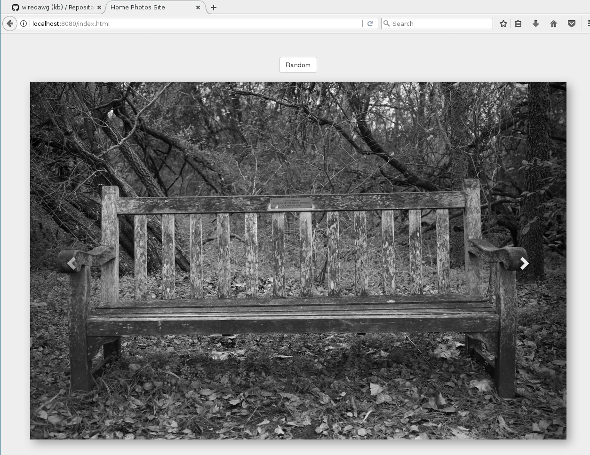

# Basic Photo Site

This page is a very simple usage of a bootstrap carousel that loads
photos dynamically from a list of urls.

# Setup

1. Create a vendor directory and but two subdirs in it, One for Bootstrap
   and the other for jquery.

   ```bash
   $ mkdir -p vendor/bootstrap vendor/jquery
   ```

2. Populate those vendor directory from npm's `dist` directory or however you perfer. Just
   be aware of path changes if you use something else and update them in `index.html`.

3. Make a directory to store photos or links to photos locally on the webserver

   ```bash
   $ ln -s ~/Photos photos
   ```

4. Populate a file called `purls.js` which contains an array of urls referring to the
   files in the `photos/` directory you just made.

   ```javascript
   var purls = [
       "/photos/img1.jpg",
       ...
   ];
   ```

5. Push to a webserver or start one locally. I use one I wrote that include SSL and basic auth:
   - https://github.com/wiredawg/sfs

   ```bash
   $ sfs -u -d . &
   ```
6. Visit the page in your browser and see something like this:

   
